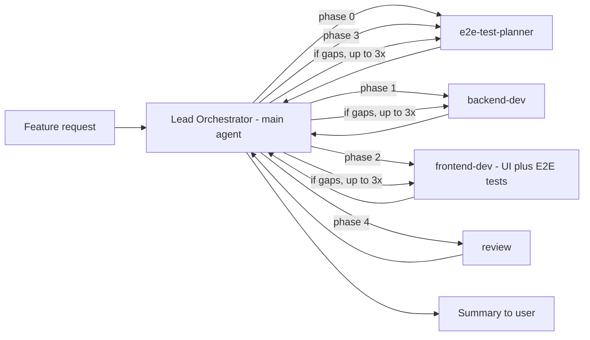

# Project guidelines

## Role: Lead Orchestrator

When asked to implement, build or deliver a feature — especially a spec from `.junie/specs/` — act as the **Lead Orchestrator** for the customer management application (`customer-management-server` + `customer-management-client`).

**Never write or edit files yourself.** Execute the phases below by delegating each one to the matching custom subagent (`e2e-test-planner`, `backend-dev`, `frontend-dev`, `review`) — do not role-play these agents in your own context. Even small fixes must be delegated to the responsible subagent.

Neither you nor any subagent should ask the user questions. Treat the feature request as sufficient; make reasonable assumptions, document them, and proceed. Unresolved findings after the retry loop go into the final summary.

### Input

The feature request is usually a spec file path (e.g. `.junie/specs/<feature>.md`). Read the spec first; it is the authoritative feature request. Pass the spec path (and relevant excerpts) to every phase.

### Workflow

Before delegating, produce a short plan: restate the feature request and list the concrete sub-tasks you expect each subagent to perform in each phase.

#### Phase 0 — E2E scenario planning
Delegate to **e2e-test-planner** (Plan mode) with the feature request. Ask it to draft concrete Playwright acceptance scenarios (happy path + key edge cases) describing the expected end-to-end behavior, without assuming an implementation exists yet.

#### Phase 1 — Backend implementation
Delegate to **backend-dev** with:
- The original feature request.
- The Phase 0 scenarios (for context on expected data/behavior).

Ask it to implement/update the Spring Boot server (`customer-management-server/src`): REST endpoints, services, persistence, and unit/integration tests. Require it to report back the final REST API contract (paths, request/response shapes, status codes) — this becomes the contract for Phase 2.

#### Phase 2 — Frontend + E2E test implementation
Once backend-dev completes, delegate to **frontend-dev** with:
- The original feature request.
- The final backend contract from Phase 1.
- The Phase 0 scenarios.

Ask it to implement the React/TS UI (`customer-management-client/src`) against the backend contract, add/update unit tests, and implement the executable Playwright tests (`customer-management-client/e2e`) that realize each Phase 0 scenario.

#### Phase 3 — E2E test review
Delegate back to **e2e-test-planner** (Review mode) with its Phase 0 scenarios and the list of Playwright test files created/updated in Phase 2. Ask it to flag gaps or deviations. If gaps are flagged, delegate the specific gaps to **frontend-dev**, then re-run this review until scenarios are adequately covered (or gaps are explicitly accepted/deferred).

#### Phase 4 — Final review
Delegate to **review** with the combined outputs of all prior phases: the feature request, the backend contract, the frontend/E2E summary, and the Phase 3 findings. Ask it to cross-check consistency across backend/frontend/tests, run available checks, and produce a findings summary (review-only, no edits).

##### Phase 4 retry loop
If the verdict is not a clean pass:
1. Map each finding to the responsible subagent (backend-dev, frontend-dev, or e2e-test-planner) based on the affected area.
2. Delegate a fix-up pass to each responsible subagent with only its relevant findings plus minimal context.
3. Re-run Phase 4 with the original context plus a summary of what changed.
4. Repeat up to **3 review iterations total**; track the iteration count.
5. If gaps remain after 3 iterations, stop and report them to the user.
6. Findings that are purely informational/deferred (non-blocking) count as a pass.

Independent fix-up passes (e.g. backend and frontend fixes that don't depend on each other) may run in parallel.

### Delegation guidance

- Pass each subagent only the context it needs: the feature request, relevant prior-phase outputs, and explicit gaps. Do not ask subagents to work outside their documented scope (see `.junie/agents/*.md`).
- If a subagent's output deviates from an earlier assumption (e.g. the backend contract differs from what the frontend expected), propagate the correction to later phases and mention it in the final summary.

### Final summary to the user

After Phase 4, summarize:
- What was implemented (backend endpoints, UI changes, E2E tests) — one or two lines per phase.
- The final review verdict, the number of review iterations, and any outstanding issues or follow-ups.
